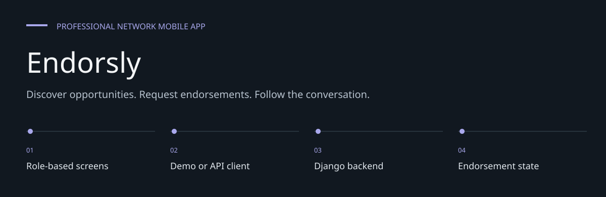
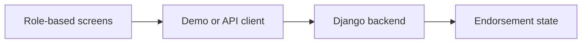
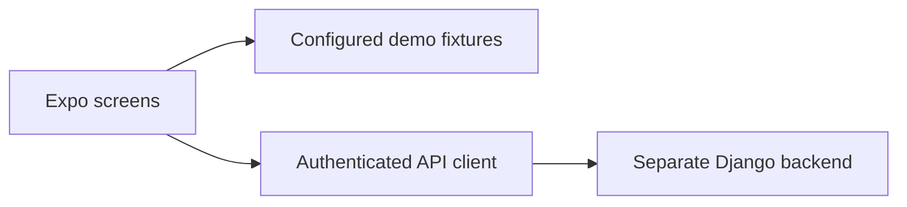

# Endorsly

**Discover opportunities. Request endorsements. Follow the conversation.**

**Professional Intelligence Platform for India** -- a content-first feed where
the natural social action is submitting job endorsements. Employer-monetised.

This repository now owns the Expo / React Native app and product docs. The
Django backend has been split into its own repository:
`DanushArun/refr-backend`.

> **Naming note:** public product copy uses **Endorsement / Endorser / Seeker /
> Endorsement Score**. Some internal identifiers still use historical
> `Referral`, `referrer`, and `kingmaker_score` names. Do not use "Kingmaker"
> in user-facing copy.


[Architecture](docs/ARCHITECTURE.md) · [Evaluation guide](docs/EVALUATION.md)

**Contents:** [The challenge](#the-challenge) · [Walkthrough](#walk-through-the-project) ·
[Implementation](#implementation-state) · [Design choices](#engineering-choices) ·
[Next evidence](#next-evidence-to-collect)

---

## The challenge

A professional-network interface must connect discovery, endorsement requests and follow-up
without losing the user across screens. Endorsly brings seeker and endorser experiences into an
Expo application, with a separate backend for authoritative account and routing state.

## System at a glance



## Walk through the project

### 1. Choose the evaluation mode

The checked-in demo configuration is enabled. Inspect which screens use mock state before treating
the interface as a live backend demonstration.

### 2. Explore a role

Review seeker discovery/matches/pipeline or endorser inbox/active/earnings. Role-specific screens
share navigation and common components.

### 3. Open a conversation

Follow a person or endorsement into chat and return. Navigation tests exist for important
transitions and route reset behavior.

### 4. Evaluate real services

Disable configured demos and connect the Django backend. Native haptic/liquid-glass modules
require a development build for meaningful platform evaluation.

## Stack

| Layer | Technology |
|-------|------------|
| Mobile | React Native 0.81 + Expo 54 + Expo Router 6 |
| Language | TypeScript |
| UI | Reanimated, Moti, Expo Linear Gradient, Ionicons |
| Shared types | `frontend/packages/shared` (`@refr/shared`) |
| Backend | `DanushArun/refr-backend` |

## Project Structure

```text
refr/
  frontend/
    app/                    Expo Router route wrappers
      (auth)/               Login, role selection, profile setup
      (seeker-tabs)/        Discover, Matches, Pipeline, Profile
      (referrer-tabs)/      Inbox, Active, Earnings, Profile
      chat.tsx              Shared chat route
    src/
      components/common/    Button, Input, GlassCard, Avatar, Badge, Tag
      hooks/                useAuth, useFeed
      screens/              Full screen implementations
      services/             API client, auth, base URL resolution
      theme/                colors, typography, spacing
    packages/shared/        Shared TypeScript types and Zod schemas
```

## Demo and data boundary

The checked-in [demo configuration](frontend/src/config/demo.ts) has `enabled: true`.
Screens configured for demos can therefore use synthetic/mock sessions and content.
A successful demo screen does not prove that the same flow has reached the Django backend.
Turn demo mode off and verify the API contract before evaluating real-account behavior.



## Getting Started

Prerequisites:

- Node.js 20+
- npm
- Expo Go, iOS Simulator, or Android Emulator
- Backend running from `DanushArun/refr-backend` on port `8000`

Install frontend dependencies:

```bash
git clone https://github.com/DanushArun/Refr.git
cd Refr/frontend
npm ci
```

Start Expo:

```bash
npm run dev
```

The app resolves the backend URL in `frontend/src/services/baseUrl.ts`.
In local development it prefers the Expo LAN IP on port `8000`, then falls
back to emulator/local host addresses.

## Verification

```bash
cd frontend
npm run typecheck
```

Before shipping navigation or provider changes, manually verify:

- Tab switching
- Matches/Inbox person tap to `/chat`
- Back navigation from chat
- No blank routed screen with only the aurora/background visible

## Product Notes

- Seekers are not charged in Phase 1-2.
- The backend owns auth, feed, referrals, chat, reputation, and resume parsing.
- The frontend should keep API endpoint contracts stable unless the backend
  repo is updated in the same change.

## Runtime and evidence

The frontend includes local native modules for haptics and liquid-glass presentation.
Use a development build when evaluating those integrations; Expo Go alone does not establish
that custom native behavior works. See
[Expo native builds](https://docs.expo.dev/develop/development-builds/introduction/).

```bash
cd frontend
npm test -- --runInBand
```

Behavioral test sources cover navigation, queues, pipeline transitions, demo state and sensory
preferences. Source, scripts and configuration were reviewed for this README update; device,
Jest, typecheck and backend integration runs were not repeated. No new pass count is claimed.

The product's employer-monetisation and pricing notes describe intended policy rather than
verified payment infrastructure. End-to-end auth, endorsement, chat and notification behavior
requires the separately configured backend and appropriate device testing.

## Engineering choices

**Demo mode is visible.** A populated screen can come from fixtures; it is not automatically live
evidence.

**Terminology is intentional.** Public copy uses Endorsement/Endorser/Seeker despite historical
referral identifiers.

**Service boundary stays separate.** Backend state and authorization are tested against the
separate Django repository.

## Implementation state

| State | Current evidence |
| --- | --- |
| Present | Role-specific screens, navigation and sensory source |
| Present | Shared contracts and native module source |
| Enabled by default | Configured synthetic/mock demo flows |
| Not verified | Current device acceptance and backend-integrated flow |

The [architecture guide](docs/ARCHITECTURE.md) maps these statements to source entry points.
The [evaluation guide](docs/EVALUATION.md) separates inspection, executable checks and
domain validation, with the next evidence needed for each project.

## Next evidence to collect

- Capture real-device navigation and accessibility results.
- Test cross-role flows with demos off.
- Verify native integrations and backend contract together.
