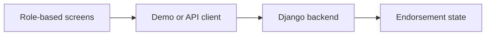

# Endorsly — Architecture and implementation

This guide follows the tracked implementation. Proposed work is identified separately.

## The problem and the system boundary

A professional-network interface must connect discovery, endorsement requests and follow-up
without losing the user across screens. Endorsly brings seeker and endorser experiences into an
Expo application, with a separate backend for authoritative account and routing state.

## Processing path

## End-to-end behavior

### 1. Choose the evaluation mode

The checked-in demo configuration is enabled. Inspect which screens use mock state before treating
the interface as a live backend demonstration.

### 2. Explore a role

Review seeker discovery/matches/pipeline or endorser inbox/active/earnings. Role-specific screens
share navigation and common components.

### 3. Open a conversation

Follow a person or endorsement into chat and return. Navigation tests exist for important
transitions and route reset behavior.

### 4. Evaluate real services

Disable configured demos and connect the Django backend. Native haptic/liquid-glass modules
require a development build for meaningful platform evaluation.

## Design choices and consequences

### Demo mode is visible

A populated screen can come from fixtures; it is not automatically live evidence.

### Terminology is intentional

Public copy uses Endorsement/Endorser/Seeker despite historical referral identifiers.

### Service boundary stays separate

Backend state and authorization are tested against the separate Django repository.

## Source entry points

### [frontend/src/config/demo.ts](../frontend/src/config/demo.ts)

This file is part of the reviewed path described above. Follow its imports and calls
for the exact interface rather than inferring behavior from the filename.

### [frontend/src/services/baseUrl.ts](../frontend/src/services/baseUrl.ts)

This file is part of the reviewed path described above. Follow its imports and calls
for the exact interface rather than inferring behavior from the filename.

### [frontend/src/services/api.ts](../frontend/src/services/api.ts)

This file is part of the reviewed path described above. Follow its imports and calls
for the exact interface rather than inferring behavior from the filename.

### [frontend/src/screens/DiscoverScreen.tsx](../frontend/src/screens/DiscoverScreen.tsx)

This file is part of the reviewed path described above. Follow its imports and calls
for the exact interface rather than inferring behavior from the filename.

###
[LaunchRouteGate.tsx](../frontend/src/components/navigation/LaunchRouteGate.tsx)

This file is part of the reviewed path described above. Follow its imports and calls
for the exact interface rather than inferring behavior from the filename.

## Implementation state

| State | Evidence boundary |
| --- | --- |
| Present | Role-specific screens, navigation and sensory source |
| Present | Shared contracts and native module source |
| Enabled by default | Configured synthetic/mock demo flows |
| Not verified | Current device acceptance and backend-integrated flow |

“Present” means tracked source or assets exist. It does not mean a production or domain
validation has passed. See [Evaluation](EVALUATION.md) for reproducible checks and limits.
